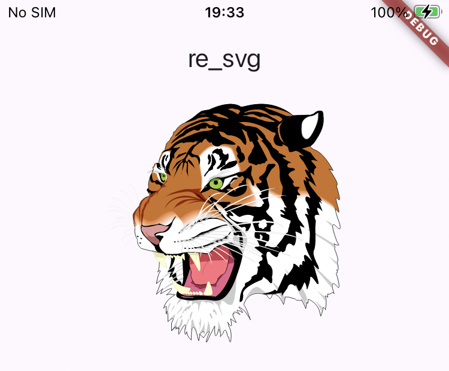

# re_svg

[](https://pub.dev/packages/re_svg)

A tiny and super-fast SVG rendering library for Flutter, with CSS support.

Underneath, the parsing and rendering of SVG run in isolates to prevent any potential frame drops.

## Getting Started
re_svg is designed for ease of use. By simply introducing the SvgView widget, SVGs can be rendered correctly.
```dart
import 'package:re_svg/re_svg.dart';

final data = """
<svg height="100" width="100">
  <circle r="45" cx="50" cy="50" fill="blue" />
</svg> 
""";

SvgView(
  data: data,
  intrinsic: true,
);
```

## Screenshot



## Supported Platforms
- [x] iOS
- [x] Android
- [x] macOS
- [ ] Windows
- [ ] Linux
- [ ] Web

## Related Projects
- [resvg_action](https://github.com/rustui/resvg_action) - Use GitHub Actions to compile the Rust library resvg for different platforms.
- [resvg_pod](https://github.com/rustui/resvg_pod) - For the iOS platform, Flutter’s local pod cannot directly download the online static library. Therefore, a new pod is created to download the resvg static library.
- [resvg_module](https://github.com/rustui/resvg_module) - An Android library for dynamically linking the Rust library resvg.

## For Rustaceans
This project demonstrates how to integrate Flutter with Rust libraries.